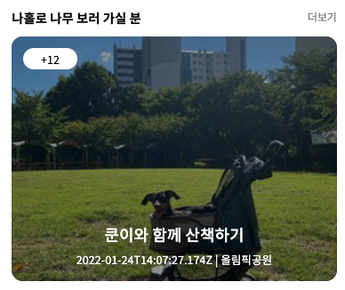
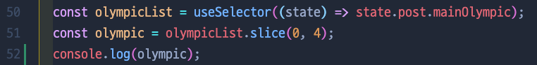
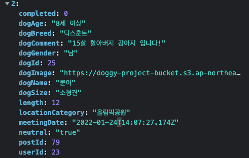
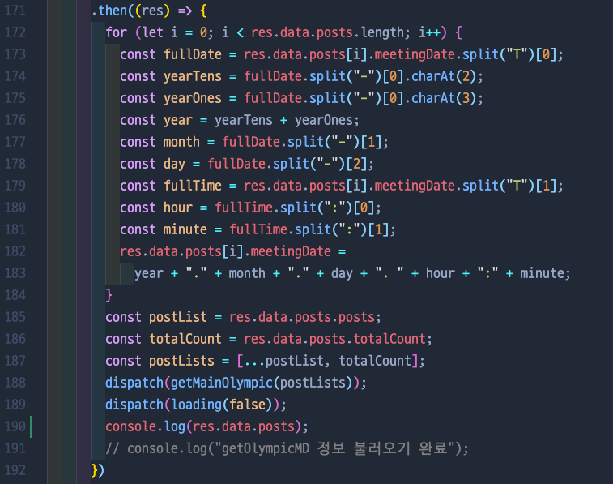
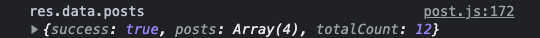
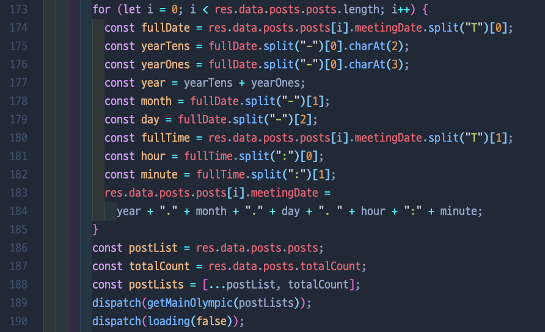

# [산책할개] - 산책가자 메인페이지에서 날짜/시간의 형식이 깨져서 들어오는 오류 발생

# ❗️Problem

### ✨ 산책가자 메인페이지에서 날짜/시간의 형식이 깨져서 들어오는 오류 발생

# ❗️Thinking Process

1. 원래는 백앤드에서 시간을 보내는 형식이 지금 보이는 것 처럼 `YYYY-MM-DDThh:mm:ss.sssZ` 형식으로 보내주는게 맞다. 서버쪽에서 시간을 좀 더 깔끔하게 정제되어 넘어오면 좋겠지만 그렇게 보내주지 못한다고해서 프론트쪽에서 정제를 하기로했다.
2. 여기서 문제는 메인 페이지의 파일인 Main.js에서 split을 한다면 서버에서 데이터가 넘어오기 전, undefined를 split하려고 해서 아예 redux middleware에서 데이터를 정제해서 보내는 방식을 선택했다.
3. 이제 여기서 진짜 문제는, 이미 이 모든 처리를 해놓았는데... 갑자기 데이터가 저렇게 날것으로 다시 들어오기 시작했다.
4. 혹시 서버쪽에서 데이터를 아예 잘 못 주고 있는거 아니야? 왜 00:00:0000이지? → 다른 데이터 확인해 보자! → 전부다 00:00... 이렇게 들어오면 서버에서 받아오는 데이터가 이상한거!
5. 다른 게시물은 `2022-01-24T14:07:27.174Z` 이런식으로 들어오는거 보니깐 서버쪽에서는 제대로 주는데, 프론트쪽에서 값을 정제하는데에서 오류가 난 것 같다는 추측! 52번째줄에서 보이는 것 처럼 메인페이지에서 불러오는 데이터를 콘솔로 찍어보았더니 정제되지않은 날것의 meetingDate가 들어옴을 확인

   

   

   

6. 서버와 axios 통신 + 데이터 값 정제하는 module 파일로 가서 어떻게 데이터를 받고 있는지 확인 → 190번째줄에 `console.log(res.data.posts)` 데이터 어떻게 받아오는지 확인

   

7. 서버쪽에서 무언가를 수정하면서 `res.data.posts` 안에 데이터를 주는것이 아닌 `res.data.posts.posts`로 주는것 확인!

   

8. 173, 174, 180, 183번째 줄에 `res.data.posts.posts`로 수정함으로써 오류 해결!

   

# ❗️Solution

### ✨ 날짜 형식이 정제되지않은 날것으로 들어오는 오류 → 서버쪽에서 데이터를 1depth 안에서 전달해줌을 파악→ redux middleware 부분 수정 후 문제 해결

---
