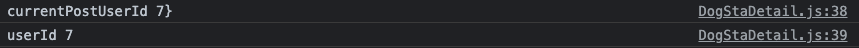
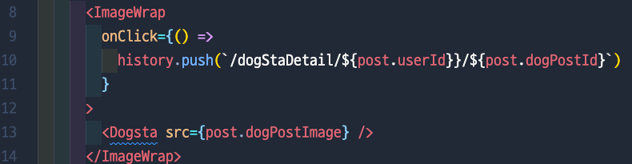
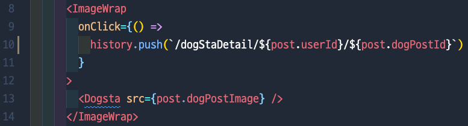
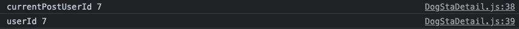

# [산책할개] - 수정/삭제 버튼이 안보이는 오류

# ❗️Problem

### ✨ MainPage - 오늘의 개스타 - 내가 올린 게시물의 상세 페이지 → (내가 올린 글 인데) 수정/삭제 버튼 안 보임

# ❗️Thinking Process

1. 개스타그램 나의 게시물을 확인 할 수 있는 다른 곳도 체크해보자!
2. MyPage → 개스타그램 나의 게시물 확인 파트 → 동일한 게시물 클릭 → 수정/삭제 버튼 잘 보이는 것 확인!
3. “오호라, 그럼 메인페이지에서만 문제인거네!” → 다시 메인페이지로 이동
4. “수정/삭제 버튼이 보이는 조건을 생각해보자” → 현재 로그인한 사람의 ID = 게시물을 올린 사람의 ID 일때!
5. currentPostUserId (= 게시물을 올린 사람의 아이디), userId (= 지금 로그인 한 사람의 아이디) 비교했을때 중괄호가 하나 더 추가 되어있어서 오류가 났던것으로 판단

   

6. 파일을 확인해 본 결과 10번째 줄에 `${post.userId}}` 에 `}` 가 하나 더 들어가 있어서 나는 오류였다.

   

# ❗️Solution

### ✨ 10번째 줄 수정 후 → console에도 잘 찍힘 → 최종적으로 수정/삭제 버튼 잘 보임

   

   
		

---
