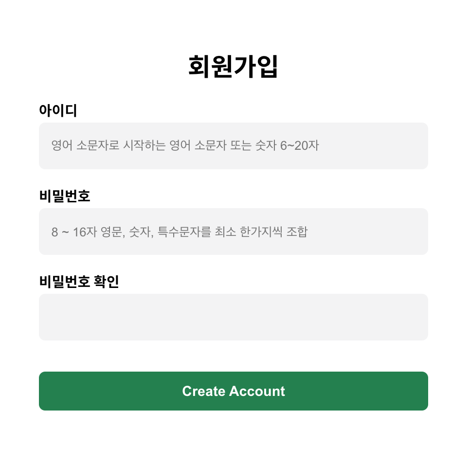
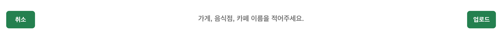
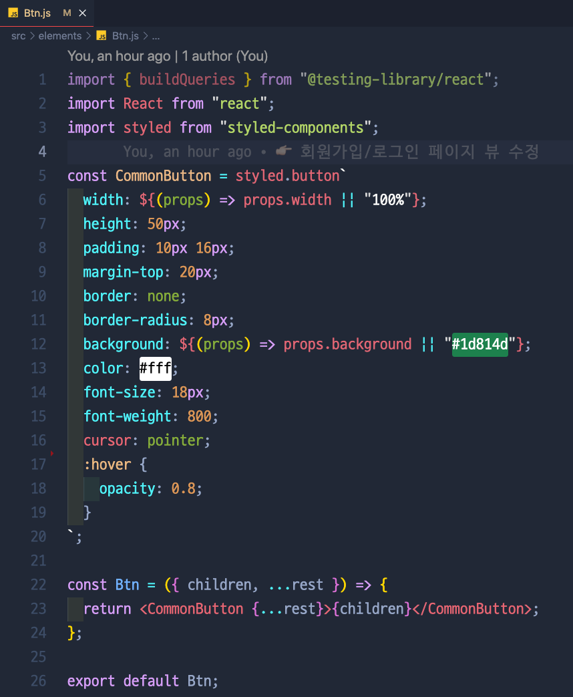
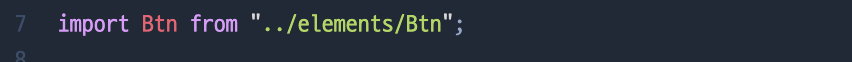
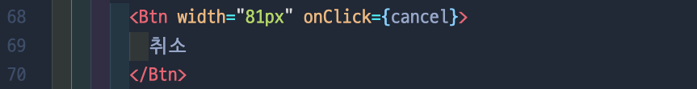

# 반복되는 요소, 다른 스타일

## ❗️ 고민 시작

> 위에서 보는 것 처럼 새로 시작한 프로젝트에는 2가지 종류의 버튼이 있다. 하나는 width가 100%로 꽉 차는 버튼이랑 다른 하나는 짧은 버튼! 이 둘은 글자 크기, 글자 색상, 모든게 같지만 width하나만 다르다. 그런데 모든게 똑같지만 요소 몇개만 다른 버튼을 만드려고 또 새로 styled-components를 다시 다 쓰는게 비효율적으로 느껴졌다.

## ❗️ 해결 방안

✍🏻 **1. Btn.js라는 파일 생성 후 공통적으로 쓸 수 있는 버튼을 만들었다.**

- 6번째 줄 → ${(props) ⇒ props.이름 || “default 값”} 을 넣어주면, 재사용할때 원하는 값을 넣지 않는 이상 default 값을 사용하게 된다.
- 23번째 줄 → 사용할 버튼 태그 사이에 {children}을 넣어줌으로써 나중에 사용할때 태그 사이에 넣는 값을 받아 올 수있음

✍🏻 **2. 생성한 버튼을 사용하고 싶은 파일에서 import 후 사용**

- 7번째 줄 → 버튼을 import 한다.
- 68번째 줄 → width=”81px” 라는 속성을 여기서 줌으로써 default 값을 쓰지 않게 된다.
- 69번째 줄 → Btn.js 파일에서 {children}으로 설정을 해 놓았기 때문에, <Btn></Btn>사이의 값이 버튼안에 보이는 글자로 받아진다.
  
  

## 🚀 Conclusion

- 재사용 가능한 Elements를 만들어서 좀 더 깔끔한 코딩이 가능해졌다.
